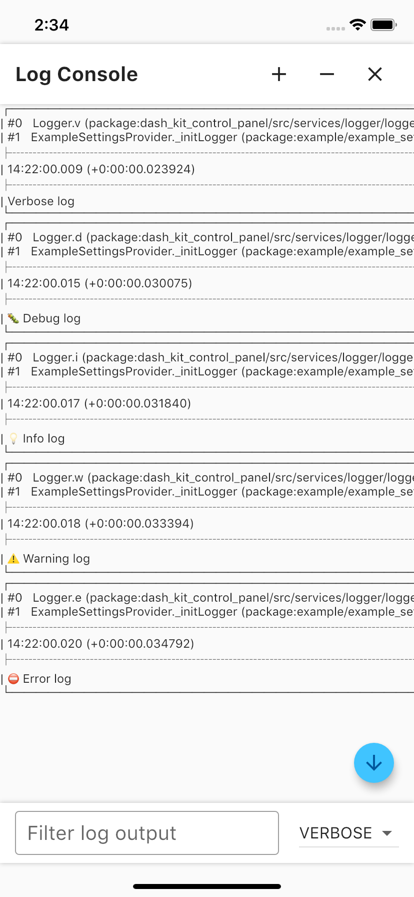

# Dash-Kit Control Panel

Control panel with debugging features for convenient app development.

## Install

To use this plugin, add ```dash_kit_control_panel ``` as a [dependency in your pubspec.yaml file](https://flutter.dev/docs/development/packages-and-plugins/using-packages). 

## Description

When you’re developing an application it is often really convenient to have access to some “developer features” such as network requests, application logs and get layout preview on devices with different screen sizes. Sometimes it also may be necessary to get device token, use proxy IP address or use debug mode for activating specific app configuration.

For all these development requirements we have made special Control Panel. This is a screen that is accessible from anywhere in the app by doing several tap gestures. There's also an opportunity of setting an access to Control Panel only from specific App Environment.

 &nbsp;&nbsp;&nbsp;&nbsp;
 <br />

 &nbsp;&nbsp;&nbsp;&nbsp;
 <br />

 &nbsp;&nbsp;&nbsp;&nbsp;
 <br />

 &nbsp;&nbsp;&nbsp;&nbsp;

## Getting Started

Wrap any widget in your app with ```ControlPanelGate``` widget for getting an access to Control Panel by using multi-tap in this widget. 

```dart
const ControlPanelGate(
  child: Text(
    'Control Panel',
    style: TextStyle(
      fontSize: 36,
      color: Colors.blue,
      decoration: TextDecoration.none,
    ),
  ),
),
```

---
</br>

It is possible to setup Control Panel with regards to your own needs. It requires to prepare ```SettingsProvider``` class that extends ```ControlPanelSettingsClass``` and in ```buildSettings()``` methods return all widgets that will be used via panel. All these widgets should implement ```ControlPanelSetting```.

In our case, we preffer using [dio Http client](https://pub.dev/packages/dio) with [alice_lightweight](https://pub.dev/packages/alice_lightweight) to handle network requests, cause they are well compatible and it's possible to add alice interseptor to dio (callback that allows allice following up requests from dio). But as was already mentioned, you may add any custom functionality you need no matter what pluggins you use.  

```dart
class ExampleSettingsProvider extends ControlPanelSettingsProvider {
  ExampleSettingsProvider({
    required this.alice,
    required this.dios,
  }) {
    _configureProxy(dios);
    _initLogger();

    ProxySettingProps.init((proxyIpAddress) {
      _proxyIp = proxyIpAddress;
    });
  }

  final Alice alice;
  final List<Dio> dios;

  String _proxyIp = '';

  @override
  Future<List<ControlPanelSetting>> buildSettings() async {
    final demoProps = DemoSettingProps(
      onDemoModeChanged: (value) {
        print('Demo mode is ${value ? 'enabled' : 'disabled'}');
      },
    );

    final proxyProps = await ProxySettingProps.standart((proxyIpAddress) {
      _proxyIp = proxyIpAddress;
    });

    final networkProps = NetworkSettingProps(
      alice: alice,
    );

    final pushProps = PushNotificationsSettingProps(
      getToken: Future.value('token'),
    );

    return [
      VersionSetting(),
      DemoSetting(demoProps),
      const DevicePreviewSetting(),
      ProxySetting(proxyProps),
      PushNotificationsSetting(pushProps),
      NetworkSetting(networkProps),
      const LicenseSetting(),
      LogConsoleButton(),
    ];
  }

  void _configureProxy(List<Dio> dios) {
    for (final dio in dios) {
      final adapter = dio.httpClientAdapter;

      if (adapter is DefaultHttpClientAdapter) {
        adapter.onHttpClientCreate = (HttpClient client) {
          client.findProxy = (uri) {
            return _proxyIp.isNotEmpty == true
                ? 'PROXY $_proxyIp:8888'
                : 'DIRECT';
          };

          client.badCertificateCallback =
              (cert, host, port) => _proxyIp.isNotEmpty == true;
        };
      }
    }
  }

  void _initLogger() {
    Logger.init(bufferSize: 25);

    Logger.v('Verbose log');
    Logger.d('Debug log');
    Logger.i('Info log');
    Logger.w('Warning log');
    Logger.e('Error log');
  }
}
```

---
</br>

In ```main.dart``` class we adding alice interceptor to dio and setting dio timeout. And finally we initialize Control Panel with ```SettingsProvider```.

Please note that it also needs to wrap MaterialApp with ```Application``` widget to activate Device Preview mode for your application.

```dart
final alice = Alice();
final navigatorKey = alice.getNavigatorKey();
final dio = Dio();

Future main() async {
  dio.interceptors.add(alice.getDioInterceptor());
  dio.options = BaseOptions(
    connectTimeout: 15 * 1000,
    receiveTimeout: 15 * 1000,
  );

  runApp(Application(
    child: ExampleApp(
      navigatorKey: navigatorKey,
      sendTestRequest: _sendTestRequest,
    ),
  ));

  final settingsProvider = ExampleSettingsProvider(
    alice: alice,
    dios: [dio],
  );

  ControlPanel.initialize(
    navigatorKey: navigatorKey,
    settingsProvider: settingsProvider,
  );

  _sendTestRequest();
}
```

--- 
</br>

You can also check the [example project](https://github.com/Dash-Kit/dash-kit-control-panel/tree/master/example).

